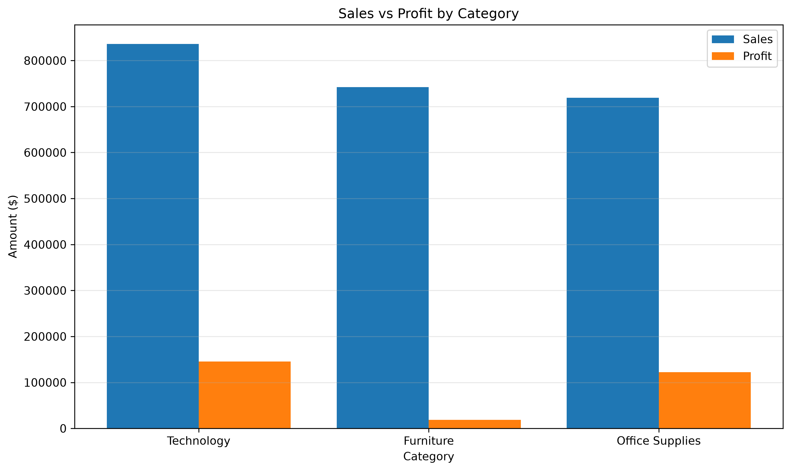
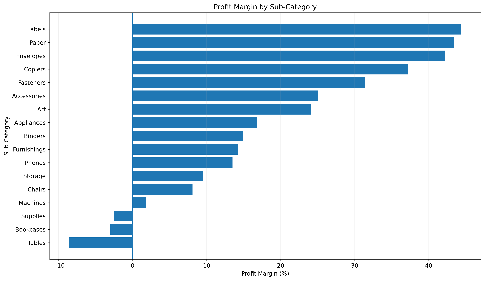
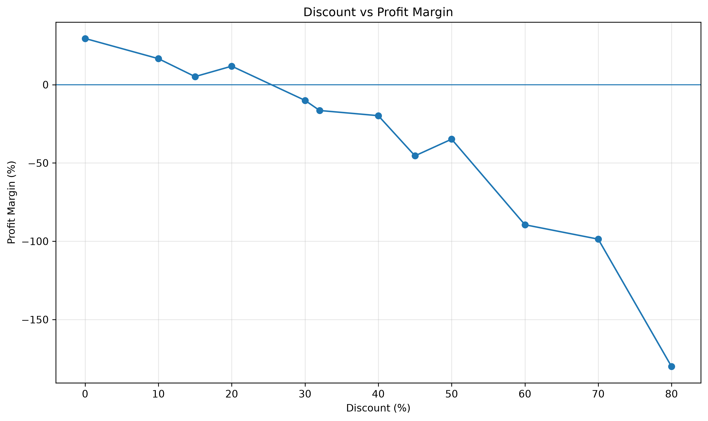
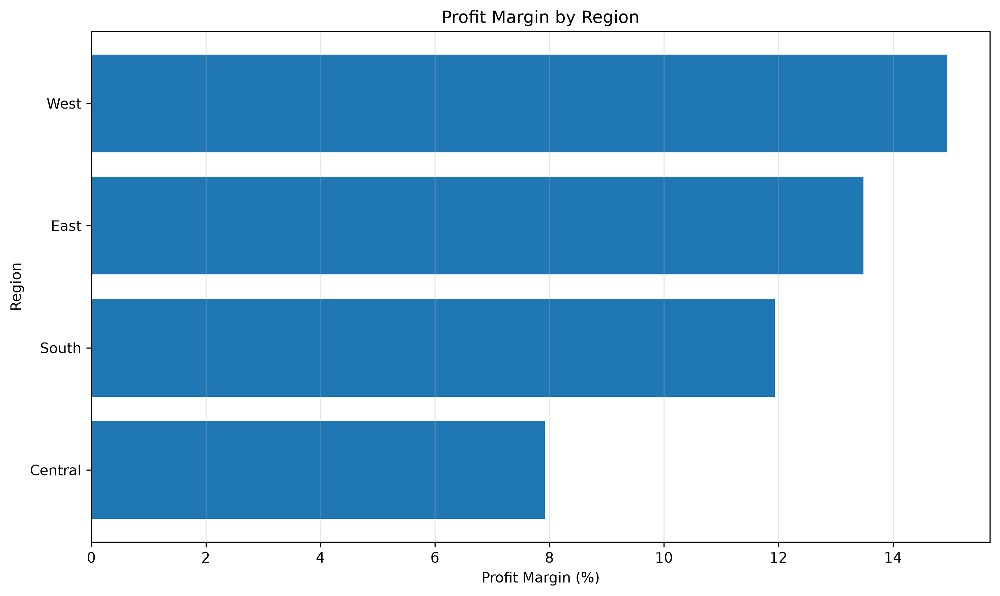
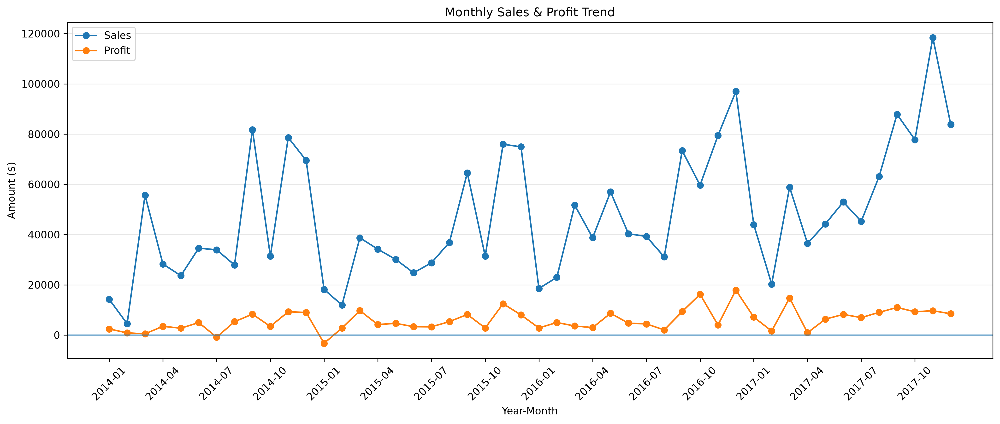
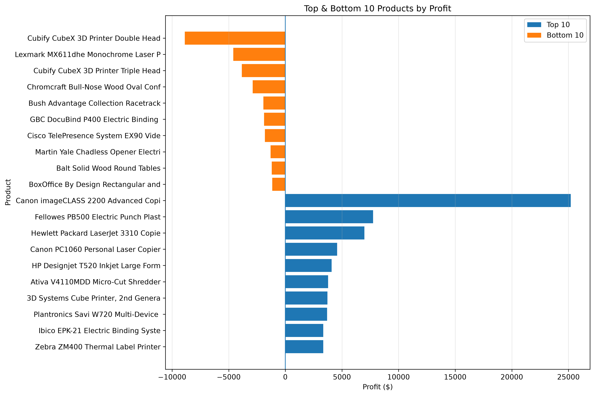

# Project 6 — Retail Sales & Profitability Analysis

## 📌 Project Overview

This project analyzes the Sample Superstore retail dataset to understand
sales performance, profitability, discount patterns, regional performance,
customer segments, product-level profitability, and shipping operations.

The objective was to move beyond basic sales reporting and identify
business areas where revenue does not necessarily translate into profit.

---

## 🎯 Business Questions

- How are sales and profit distributed across product categories?
- Which sub-categories generate losses?
- How does discount level relate to profitability?
- Which regions have stronger or weaker profit margins?
- Which customer segments generate the most revenue and profit?
- Which products generate the highest and lowest profits?
- How does profitability vary over time?
- Does shipping mode show meaningful differences in profitability?

---

## 📊 Dataset

**Dataset:** Sample Superstore

**Records:** 9,994  
**Original Columns:** 21

The dataset contains information about:

- Orders
- Customers
- Products
- Categories
- Sales
- Quantity
- Discounts
- Profit
- Regions
- Shipping modes
- Order and shipping dates

---

## 🛠️ Tools & Technologies

- Python
- Pandas
- NumPy
- Matplotlib
- Jupyter Notebook

---

## 🧹 Data Preparation

The initial data-quality audit found:

- 9,994 records
- 21 original columns
- 0 missing values
- 0 duplicate rows

The following transformations were performed:

- Converted Order Date and Ship Date into datetime format
- Created Year
- Created Month
- Created Month Name
- Created Quarter
- Calculated Profit Margin
- Calculated Shipping Days

The final analytical dataset contained 27 columns.

---

## 📈 Overall Business Performance

| KPI | Result |
|---|---:|
| Total Sales | $2,297,200.86 |
| Total Profit | $286,397.02 |
| Overall Profit Margin | 12.47% |
| Total Quantity Sold | 37,873 |
| Total Orders | 5,009 |
| Total Customers | 793 |

---

## 🔍 Key Findings

### 1. Category Performance

Technology generated approximately $836K in sales and $145K
in profit with a 17.40% margin.

Furniture generated approximately $742K in sales but only
$18K in profit, resulting in a 2.49% margin.

Office Supplies generated approximately $719K in sales and
$122K in profit with a 17.04% margin.

This demonstrates that sales volume alone does not fully describe
business profitability.

---

### 2. Loss-Making Sub-Categories

Three sub-categories showed negative aggregate profit:

| Sub-Category | Sales | Profit | Profit Margin |
|---|---:|---:|---:|
| Tables | $206,965.53 | -$17,725.48 | -8.56% |
| Bookcases | $114,879.996 | -$3,472.56 | -3.02% |
| Supplies | $46,673.54 | -$1,189.10 | -2.55% |

Tables represented the largest aggregate loss among the
loss-making sub-categories.

---

### 3. Discount & Profitability

Higher discount levels were associated with substantially weaker
aggregated profit margins in the dataset.

The aggregated margin was positive at lower discount levels but
became negative at higher levels.

For example:

- 0% discount → 29.50% margin
- 20% discount → 11.81% margin
- 30% discount → -10.05% margin
- 50% discount → -34.80% margin
- 70% discount → -98.66% margin
- 80% discount → -180.03% margin

This represents an observed association in the dataset and should
not be interpreted as proof that discounting alone causes losses.

---

### 4. Regional Performance

| Region | Sales | Profit | Profit Margin |
|---|---:|---:|---:|
| West | $725,457.82 | $108,418.45 | 14.95% |
| East | $678,781.24 | $91,522.78 | 13.48% |
| South | $391,721.91 | $46,749.43 | 11.93% |
| Central | $501,239.89 | $39,706.36 | 7.92% |

Central had the lowest overall profit margin among the four regions.

Further analysis showed Central Furniture generated approximately
$164K in sales but had a negative margin of -1.75%.

---

### 5. Customer Segment Performance

| Segment | Sales | Profit | Profit Margin |
|---|---:|---:|---:|
| Consumer | $1.161M | $134.1K | 11.55% |
| Corporate | $706.1K | $91.8K | 13.03% |
| Home Office | $429.7K | $60.3K | 14.03% |

Consumer generated the highest sales and absolute profit, while
its profit margin was lower than the Corporate and Home Office segments.

---

### 6. Product-Level Profitability

The analysis identified substantial differences between individual
products.

The highest-profit product in the analysis was:

**Canon imageCLASS 2200 Advanced Copier**

- Sales: $61,599.82
- Profit: $25,199.93
- Profit Margin: 40.91%

The largest loss among the analyzed products was:

**Cubify CubeX 3D Printer Double Head Print**

- Sales: $11,099.96
- Profit: -$8,879.97
- Profit Margin: -80.00%

---

### 7. Shipping Performance

Shipping modes showed clear differences in average delivery duration:

| Ship Mode | Avg. Shipping Days |
|---|---:|
| Same Day | 0.04 |
| First Class | 2.18 |
| Second Class | 3.24 |
| Standard Class | 5.01 |

Profit margins across shipping modes were relatively close,
ranging from approximately 12% to 14%.

---

## 📊 Visualizations

The project includes visual analysis for:
1. Sales vs Profit by Category
2. Profit Margin by Sub-Category
3. Discount vs Profit Margin
4. Profit Margin by Region
5. Monthly Sales & Profit Trend
6. Top & Bottom 10 Products by Profit
### 1. Sales vs Profit by Category


### 2. Profit Margin by Sub-Category


### 3. Discount vs Profit Margin


### 4. Profit Margin by Region


### 5. Monthly Sales & Profit Trend


### 6. Top & Bottom 10 Products by Profit

---

## 💡 Business Recommendations

Based on the observed patterns:

1. Review discounting practices, particularly at higher discount levels.
2. Investigate the pricing and cost structure of Tables and Bookcases.
3. Closely monitor Furniture profitability in the Central region.
4. Identify and monitor products generating substantial losses.
5. Evaluate business performance using profit margin alongside sales volume.
6. Combine product, category, region, segment, and discount analysis
   when evaluating commercial performance.

---

## ⚠️ Analytical Limitation

The analysis identifies patterns and associations within the dataset.
The observed relationship between discount and profitability does not
establish causation.

Further analysis using product costs, pricing rules, promotion history,
customer acquisition costs, and other operational variables would be
required to determine the underlying causes of profitability differences.

---

## 🎓 Skills Demonstrated

- Data Cleaning
- Exploratory Data Analysis (EDA)
- Python
- Pandas
- Data Aggregation
- GroupBy Analysis
- Business KPI Analysis
- Profitability Analysis
- Time-Series Analysis
- Customer Segmentation
- Product Analysis
- Data Visualization
- Business Insight Generation

---

## 📁 Project Structure

```text
Project_6_Retail_Sales_Profitability/
│
├── Sample - Superstore.csv
├── Project_6_EDA.ipynb
├── README.md
└── visualizations/
